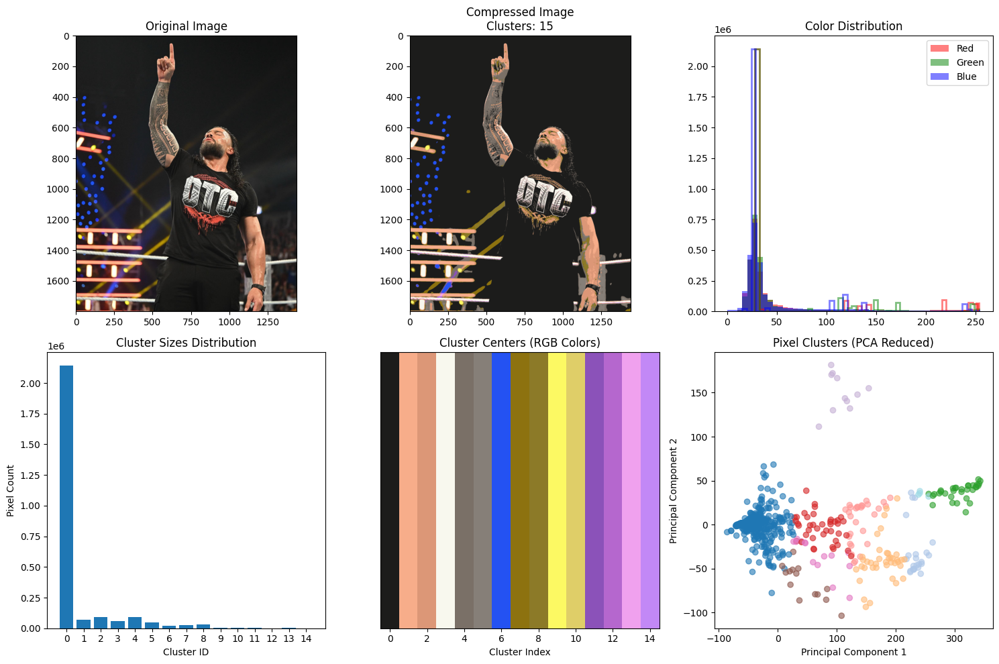

# Image Compression Using Mean Shift Clustering

## Overview  
This project implements an image compression technique using the Mean Shift clustering algorithm in Python. The goal is to reduce the size of an image while preserving its visual quality by clustering similar colors and representing them with fewer color values. The project includes a detailed analysis of the compression process, visual results, and metrics to evaluate the effectiveness of the compression.

## Features  
- **Image Preprocessing**: Loads and converts an image to the RGB color space using OpenCV.  
- **Mean Shift Clustering**: Applies the Mean Shift algorithm to cluster similar colors in the image, reducing the color palette.  
- **Compressed Image Generation**: Reconstructs the image using cluster centers, resulting in a compressed version with fewer colors.  
- **Metrics Calculation**: Computes key metrics such as original and compressed image sizes, theoretical compression rate, and actual file compression rate (when saved as PNG).  
- **Visualization**: Generates a comprehensive set of plots to analyze the compression results, including:  
  - Original and compressed image comparison.  
  - Color distribution histograms for RGB channels.  
  - Cluster sizes distribution.  
  - Cluster centers (color swatches).  
  - PCA-reduced pixel clusters for visualizing color grouping.  

## Technologies Used  
- **Python Libraries**:  
  - `numpy`: For numerical operations and array manipulation.  
  - `opencv-python (cv2)`: For image loading, preprocessing, and saving.  
  - `matplotlib`: For plotting and visualization.  
  - `scikit-learn`: For Mean Shift clustering (`MeanShift`, `estimate_bandwidth`) and PCA (`PCA`) for dimensionality reduction.  
- **Environment**: Developed in a Jupyter Notebook (as seen in the `.ipynb` file).  

## How It Works  
1. **Image Loading**: The image is loaded and converted from BGR to RGB color space.  
2. **Mean Shift Clustering**: The image pixels are reshaped into a 2D array and clustered using Mean Shift, which groups similar colors based on their RGB values.  
3. **Compression**: The image is reconstructed by replacing each pixel's color with the color of its assigned cluster center, reducing the total number of colors.  
4. **Metrics**: The script calculates the theoretical and actual (PNG) compression rates, along with the number of clusters used.  
5. **Visualization**: Multiple plots are generated to provide insights into the compression process, such as color distribution, cluster sizes, and a PCA scatter plot of pixel clusters.  

## Results 

 

- The project successfully compresses the input image, achieving a theoretical compression rate of **6.00x** and a file compression rate of **6.56x** (as shown in the output).  
- The compressed image uses **15 clusters**, significantly reducing the color complexity while maintaining visual fidelity.  
- Visualizations provide a clear comparison between the original and compressed images, along with detailed insights into the clustering process.  

## Usage  
1. **Requirements**: Install the required libraries (`numpy`, `opencv-python`, `matplotlib`, `scikit-learn`).  
   ```bash
   pip install numpy opencv-python matplotlib scikit-learn

2. **Input**: Provide the path to an image file (e.g., RomanReigns.jpg in the script).
3. **Run the Script**: Execute the Jupyter Notebook or Python script to process the image, calculate metrics, and display visualizations.
4. **Output**: The script prints compression metrics and displays a figure with six subplots analyzing the compression results.

## Example Output

 

- Original Size: 7593.75 KB
- Compressed Size (theoretical): 1265.67 KB
- Theoretical Compression Rate: 6.00x
- File Size Original (PNG): 2395.20 KB
- File Size Compressed (PNG): 364.85 KB
- File Compression Rate: 6.56x

## Future Improvements
- Experiment with different clustering algorithms (e.g., K-Means) to compare compression performance.
- Add support for adjustable parameters (e.g., quantile for bandwidth estimation) to fine-tune the compression.
- Implement a user interface for easier interaction and image selection.
- Explore advanced image quality metrics (e.g., SSIM, PSNR) to better evaluate the visual quality of the compressed image.

## How to Contribute
1. Fork the repository on GitHub.
2. Clone the forked repository to your local machine.
3. Create a new branch for your changes.
4. Make your modifications or improvements.
5. Test your changes to ensure they work as expected.
6. Commit and push your changes to your forked repository.
7. Create a pull request to the main repository for review.

## License
This project is licensed under the MIT License. Feel free to use, modify, and distribute the code as per the license terms.
